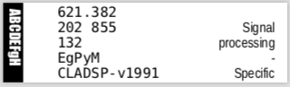
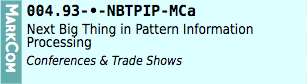

# MCxPrint

<a id="toc"></a>
[Usage](#linkUsage) •
[Examples](#linkSetup) •
[Setup](#linkSetup) •
[Resources](#linkResources)

_`MCxPrint` is a platform-agnostic, pure Swift package which programmatically generates printable SVG files from JSON input. The SVG files are also converted to PDF via Cairo `svg2pdf`._ 

The `MCxPrint` Swift package is structured to provide both a command line tool and framework for inclusion in other Swift Packages. The command line tool supports both desktop and server backend workflows. Although, the current document layout focus is labels, the framework is intended to be extensible so that other layouts can be added.


## Setup <a id="linkSetup"></a>[▴](#toc)

**Data Input**

Book label JSON data files are read from `/var/spool/mcxprint_spool/`. Each layout type has one-to-one association with a subdirectory within `mcxprint_spool`. Currently implemented directories are:

* `labelfile`
* `labelbook`


**Typography**

`MCxPrint` uses JSON-base font metrics generated by <code>[MCxFontMetrics](https://github.com/VaporExamplesLab/MCxFontMetrics)</code> A `MCxPrint` `<PostscriptFontName>_<PointSize>.json` for each font used needs to be placed in `/opt/local/fontmetics/`. The corresponding font must also be installed on the system.

**PDF Generation**

At this development phase, PDF generations is based on Cairo `svg2pdf`. At some future date PDF generation would be switched to something like [PureSwift/Cairo](https://github.com/PureSwift/Cairo).

_macOS_

``` sh
brew install svg2pdf
```

_Ubuntu_

If Inscape is installed, then the following scripts can be added.  Apply `chmod +x` to the script files. Place the scripts someplace know to the `$PATH` such as `~/bin/`, `/usr/local/bin` or `/opt/local/bin/` 

`svg2pdf`

``` sh
#!/bin/bash

for i in $@; do
  inkscape --without-gui --export-pdf="$(basename $i .svg).pdf" $i
done
```

`svg2png`

``` bash
#!/bin/bash

for i in $@; do
  inkscape --without-gui --export-png="$(basename $i .svg).png" $i
done
```

Alternately, [CairoSVG](https://cairosvg.org/) could be setup up on systems with Python 3.5+.

## Template Examples <a id="linkOutput"></a>[▴](#toc)

The library book label is sized for the Brother PT 24mm (1") laminated labels.



The library file label is sized for the Avery 5027 label sheet or equivalent. 



## Resources <a id="linkResources"></a>[▴](#toc)

* [StackOverflow: Determine String bounding box in portable Swift? ⇗](https://stackoverflow.com/questions/56548870/determine-string-bounding-box-in-portable-swift)